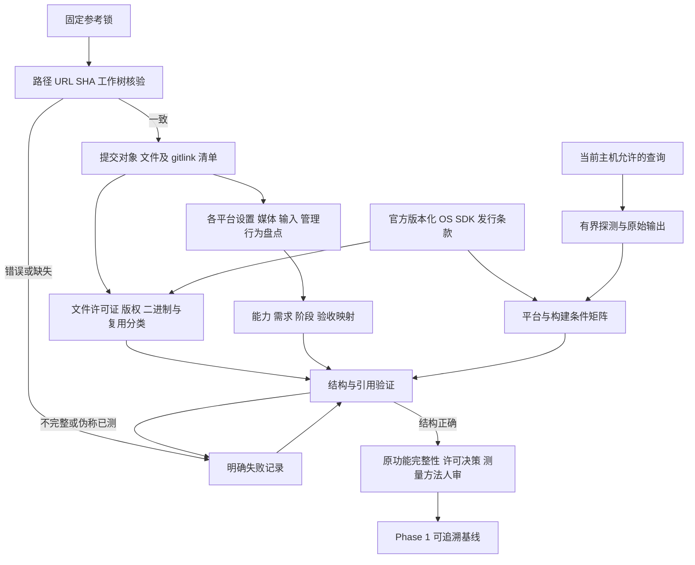

# Phase 1: 来源、原功能与环境基线 - Research

**Researched:** 2026-10-07
**Domain:** 固定源码来源、用户能力覆盖、许可/分发证据、工具环境与测量方法
**Confidence:** MEDIUM（在线资料按 research confidence seam 得出 MEDIUM；本地源码观察逐条标明 VERIFIED，法律和支持结论不越过证据）

## User Constraints

本阶段没有 CONTEXT.md；编排器传达用户选择直接依据已批准项目约束研究和规划。以下引用来自 AGENTS.md，不伪造 discuss-phase 决定。[VERIFIED: AGENTS.md:13-21]

<!-- DATA_H7pL2sQ9_START -->
- **仓库**：Aether 单主仓库，Helios/Selene 单一产品版本体系；平台差异在仓库内适配。
- **技术**：Selene Flutter；Dart 负责界面、设置、会话操作；媒体热路径和系统集成在原生层。
- **协议**：在 NVIDIA GameStream 基础上重构扩展，以固定版本 Moonlight/Sunshine 源码核验基线；不可自行切换为从零选择 WebRTC/QUIC 整体替代。
- **兼容**：服务端 Windows 10/11 是硬要求；具体最低 build 在 Phase 1/3–5 验证后锁定，不能借参考上游提高最低版本。
- **能力**：不能以“重构”为由删除原功能；设备/OS 不支持时需能力协商、说明与证据。
- **资源**：并行流数受 GPU 编码会话、解码器、显存和带宽限制；需事前协商和可解释拒绝。
- **工作流**：细粒度阶段，通常每阶段 1–3 个计划；超过单一子系统或验收链路就拆阶段。
- **环境**：当前 Windows 工作站，无 iOS/macOS 实机。Apple 构建需 macOS/Xcode 工具链或 CI；实机功能/性能/安装验证进入 TODO，不作为 v1 发布阻碍。构建证据与实机证据分别记录，可请求用户安装依赖。
- **流程**：源码研究、计划检查、完成验证、Git 文档追踪开启；关键节点确认，不自动开始全部产品实现。
<!-- DATA_H7pL2sQ9_END -->

没有新增已锁定技术选择。本研究的文件命名、数据字段和计划拆分均是交给 planner 落实的工程建议；不替用户决定项目许可证、发行渠道、最低系统版本或性能门槛。

## Project Constraints (from AGENTS.md)

以下为行动指令摘要，完整原文优先。[VERIFIED: AGENTS.md:67-74,87-94]

- 先读 STATE 与当前阶段直接相关文档；遵循 GSD 工作流，文档纳入主仓库 Git；研究输出只写本阶段 RESEARCH，提交由编排器处理。
- 以 ARCHITECTURE 和 SESSION-MODEL 划定责任边界；这是 greenfield，不能从参考目录推导已有产品实现模式。
- 原功能全集必须保留；新增遗漏补入 v1 需求、路线图与验收，不默认塞入 TODO。
- 单一 Selene Flutter 应用，共享契约；UI 与原生实时/系统路径分离。
- 参考 checkout 是忽略的研究资料；不改为子模块、不当产品代码、不把产品提交路由到它们。
- 显示组与实例在断连/切换后保活，直到显式停止；共享 Windows 登录桌面中的控制租约全局唯一。
- 小阶段、顺序互动、仅具体关键决策确认；本阶段不自动开展产品骨架、驱动安装或其他产品阶段。
- 区分候选、用户约束、实际测试结果；API 存在、README 声明、工具出现在 PATH 均不等于平台/驱动支持验证。

<phase_requirements>
## Phase Requirements

需求逐字引自已打开的定义。[VERIFIED: .planning/REQUIREMENTS.md:14-16]

<!-- DATA_r8M2cN6v_START -->
| ID | Description | Research Support |
|----|-------------|------------------|
| BASE-01 | 维护者能查阅指定平台原功能逐项清单，每项有源码或设置锚点、需求与验收映射。 | 平台×能力原子行、设置覆盖台账、固定提交锚点、需求/阶段/测试映射与遗漏闭合 |
| BASE-02 | 维护者能复现固定 SHA 参考源码，并查阅逐文件来源、生产复用许可与各端分发审计结论。 | SHA/dirty/gitlink 清单、逐文件来源索引、复用分类和实际发行路径审计 |
| BASE-03 | 维护者能运行环境探测，得到缺失依赖、最低 OS/架构、测试机器与性能测量方案。 | 有界 doctor、原始输出与标准化状态、版本化支持矩阵、测试设备台账和可复现测量协议 |
<!-- DATA_r8M2cN6v_END -->
</phase_requirements>

## Summary

Phase 1 应交付三条可复现验收链：来源与分发、原能力与需求映射、环境与测量方法。本阶段的成功不是构建流媒体产品，而是让后续 planner 不依赖未经核验的 README、宽泛能力族或 PATH 检测。现有能力矩阵明确自称初步盘点；正式矩阵须扩充源码与设置项，并将遗漏补入 v1。[VERIFIED: docs/FEATURE-PARITY.md:3-7,26-30]

本次逐一读取锁文件并运行 HEAD/status 检查：九个参考仓库 SHA 均匹配、工作树无改动；原文锁元数据为 `"schemaVersion": 1`、`"purpose": "Local source research; not production dependencies"`、`"submodulesInitialized": false`。[VERIFIED: references/upstream-lock.json:2-4,6-95; 本次 git rev-parse/status 探测] 但顶层 SHA 不能替代子模块和二进制审计；common-c README 明确要求特定 ENet fork，已读 .gitmodules 定义 `path = enet` / `url = https://github.com/cgutman/enet.git` 与 `path = nanors` / `url = https://github.com/sleepybishop/nanors.git`。[VERIFIED: references/upstream/moonlight-common-c/README.md:9; references/upstream/moonlight-common-c/.gitmodules:1-6]

在线 Flutter 表目前描述 3.47，而本机缓存元数据描述 3.44.0；表中的 OS/架构范围只能用于它声明的 SDK 版本，不能直接变成 Aether 支持承诺。[CITED: https://docs.flutter.dev/reference/supported-platforms] 原生设备、媒体与发行路线的条件应单独列出；尤其 Win10/11 主机最低 build 仍待早期原型收敛，Apple 构建不能因为实机 TODO 而省略。[VERIFIED: AGENTS.md:16,20; docs/PLATFORM-MATRIX.md:16-25]

**Primary recommendation:** 用现有 Node/Git/PowerShell 与纯数据验证器完成三个小计划；先建立固定源码证据、再盘点能力、最后跑 doctor 并形成供用户审阅的基线和阻碍包。不要在本阶段增加媒体库、客户端骨架或驱动。

## Architectural Responsibility Map

本表是阶段交付责任建议；产品边界依据已读架构和会话文档。[VERIFIED: docs/ARCHITECTURE.md:24-37,64-66; docs/SESSION-MODEL.md:23-30,38-50]

| Capability | Primary Tier | Secondary Tier | Rationale |
|------------|-------------|----------------|-----------|
| 参考恢复、SHA/gitlink/文件来源核验 | 本地开发工具 | 证据数据/文档 | 无生产服务；保留研究 checkout 与产品仓库边界 |
| 原用户能力及适用条件盘点 | 基线数据/文档 | 人工源码审阅 | 一条可观察能力可涉及多平台和多实现文件；记录证据，不移植 UI |
| 能力→需求→阶段→验收 | 基线验证器 | 人工范围审阅 | 自动保证引用完整；是否穷尽能力必须人审 |
| 许可与发行路线 | 证据台账/文档 | 人工关键决策 | 自动校验来源完整；授权和组合分发结论不能由字符串扫描替代 |
| 工具、OS/架构和测试设备 | 本地 doctor | 版本化平台矩阵 | 能运行工具与能编译、能使用媒体硬件分别报告 |
| 性能场景与记录格式 | 测量工具/协议文档 | 后续原型 | 固定变量和指标语义，Phase 6/10 收集数值后确认门槛 |

## Standard Stack

### Core

不安装第三方软件包。复用仓库已有脚本风格和机器现有工具；以下版本是本次观测，不是新的全项目最低版本决定。[VERIFIED: scripts/validate-planning.cjs:1-5; scripts/sync-upstream.ps1:1-5; 本次版本命令]

| Tool | Observed version | Purpose | Why use it |
|------|------------------|---------|------------|
| Node.js | v24.14.0 | JSON/Markdown 引用验证、文件索引、内置测试 | 现有 validator 已用 CJS 和 Node 内置模块；无需包安装 |
| Git | 2.54.0.windows.1 | 固定提交/对象/工作树/gitlink 查询 | 复用现有参考锁与同步脚本 |
| PowerShell | 7.6.3 | Windows doctor 与恢复入口 | 现有同步脚本采用参数、LiteralPath 和绝对路径校验 |

### Supporting

| Tool | Role this phase | Evidence |
|------|-----------------|----------|
| Node `node:test`、`node:assert/strict` | 对验证器做真实负例测试，不引入 Jest/Vitest | [CITED: https://nodejs.org/download/release/v24.14.0/docs/api/test.html] |
| Node `node:child_process` | 参数数组、有界版本/查询子进程；Windows 批处理另设固定启动方式 | [CITED: https://nodejs.org/download/release/v24.14.0/docs/api/child_process.html] |
| Git `ls-tree` / `show` | 从提交对象取文件和子模块固定值；本次ls-tree查询成功，不依赖本次失败的submodule shell wrapper | [VERIFIED: 本次git ls-tree输出] [CITED: https://git-scm.com/docs/git-submodule] |
| Flutter/SDK/VS/WDK/Android 工具 | doctor 的被探测对象；不在此阶段默认安装/升级 | [VERIFIED: docs/DEVELOPMENT.md:14-22] |

**Installation:** 无。本阶段无需 package manager。若未来计划添加外部扫描器/依赖，必须重新运行包合法性门禁，不能沿用本研究的无安装结论。

**Version verification:** 上表来自 `node --version`、`git --version` 和 PowerShell 版本对象。本阶段不推荐 registry 包，故 npm/PyPI 发布日期不适用；保留现有工具版本并标明采集日期。生产 Flutter/原生依赖锁定仍属于后续决定。[VERIFIED: .planning/research/STACK.md:17-19]

## Package Legitimacy Audit

不新增或安装外部包，因此本阶段无需包合法性查询；Node 内置模块不作为 npm 包安装。不要为了许可扫描引入未核验扫描包。参考仓库是源码证据，不是获准产品依赖。[VERIFIED: references/upstream-lock.json:4; docs/DEVELOPMENT.md:26-28]

## Architecture Patterns

### System Architecture Diagram

以下是建议的审计数据流，不表示产品已经实现。



### Recommended Project Structure / Deliverables

扩充已有 FEATURE-PARITY、PLATFORM-MATRIX、DEVELOPMENT 和 references/UPSTREAM 文档，不另造互相冲突的文字基线。建议在主仓库增加机器可读的功能矩阵、设置覆盖台账、文件来源清单、发行审计、doctor 报告和测量场景定义；位置和文件名由 planner 定义为新增产物，不能声称已经存在。新增验证器放 scripts，直接执行；对应失败场景放 tests。[VERIFIED: docs/FEATURE-PARITY.md:26-30; docs/DEVELOPMENT.md:30-36; scripts/validate-planning.cjs:34-47]

| Component / proposed output | Responsibility | Minimum content |
|-----------------------------|----------------|-----------------|
| 参考锁与恢复脚本增强 | 可复现来源 | 原始 URL/commit、校验退出码、dirty 状态、gitlink SHA、未初始化子模块说明 |
| 每仓库文件来源清单 | 文件级审计 | repo+commit+相对路径、Git blob ID、文件类别、许可证证据、版权/例外、复用意图、未决项 |
| 平台功能矩阵与设置覆盖台账 | 原能力完整性 | 原子能力、平台/条件、源码或设置锚点、需求、阶段、测试案例、证据类别 |
| 发行审计与阻碍清单 | BASE-02 可审阅结论 | 每端候选渠道、源码/二进制/驱动范围、条款来源和日期、义务、未决项、处理责任 |
| doctor 与环境快照 | 可重复观测 | 命令解析结果、实际调用、版本、退出码、耗时、stdout/stderr、超时/失败、依赖用途 |
| 平台/设备/测量基线 | BASE-03 方法 | SDK版本→OS/架构声明→原生条件→测试机器→未测项；场景参数与原始记录格式 |

### Pattern 1: 固定提交证据，避免行号漂移

每条来源锚点记录仓库、锁定 commit、相对文件、符号/设置 key、起止行和短原文。验证锚点必须在 commit 对象存在，并核对引用原文；使用 blob ID 保存内容身份。Markdown 汇总引用机器数据，采用确定性排序，避免每次审计产生随机大 diff。目录级许可证继承可用于明确范围；带独立头部/第三方目录/二进制的文件必须单独审阅，不将未知文件批量判成“可复用”。这是基于现有固定 SHA 模式的工程建议。[VERIFIED: scripts/sync-upstream.ps1:11-21,24-34; references/upstream-lock.json:6-95]

同步脚本创建路径的已读原文如下；不存在时才创建/拉取，已有 checkout SHA 不一致直接报错，dirty 只警告。应保留已有改动，但正式证据验证必须把 dirty 与 clean 区分，不能把警告当通过。[VERIFIED: scripts/sync-upstream.ps1:11-25]

<!-- DATA_s4R9bT1z_START -->
```powershell
$aetherExpected = [IO.Path]::GetFullPath((Join-Path $aetherRoot ('references/upstream/' + $aetherRepo.name)))
$aetherTarget = [IO.Path]::GetFullPath((Join-Path $aetherRoot $aetherRepo.path))
if ($aetherTarget -ne $aetherExpected -or $aetherRepo.name -notmatch '^[a-z0-9-]+$') { throw 'Invalid lock path' }
```
<!-- DATA_s4R9bT1z_END -->

Gitlink 本次查询实际返回 common-c ENet commit `aca87840b57f045a1f7f9299e4b1b9b8e2a5e2f1` 和 nanors commit `b1e3c22ca0cdc0bb83e3cd6ed1a2fc77869ed99a`。该结果是查询观察，不替代对子模块源码/许可证的阅读；把它们写入正式来源索引后逐文件审计。`git submodule status` 本次失败输出为 `sh.exe: *** fatal error - couldn't create signal pipe, Win32 error 5`，因此未得到子模块初始化状态的新观测；采用 ls-tree 加目录/对象存在检查，不自动 recursive download。[VERIFIED: 本次 git ls-tree 与 git submodule status 输出; references/upstream/moonlight-common-c/.gitmodules:1-6]

### Pattern 2: 设置覆盖台账加行为追踪

按平台分别盘点，不用 Qt 条目代表 Android/iOS。每个设置 key 必须映射到原子能力，或解释它为何仅是旧 UI 实现细节/弃用设置/目标之外能力；每条排除都需源码依据。除设置，还要审阅快捷键、命令行、权限、输入回调、网络、打包脚本及非默认能力。一个能力可以映射既有宽泛需求，但必须有独立测试案例；真正未覆盖的用户能力在执行时补需求并保持路线图“一项需求一个主要阶段”规则。[VERIFIED: docs/FEATURE-PARITY.md:3-5,26-30; scripts/validate-planning.cjs:8-10,27-31]

**本次确认的盘点入口/易漏项，均不是产品已支持声明：**

<!-- DATA_6qE3nW8a_START -->
| Source | Verified evidence / literal quote | Planning implication |
|--------|-----------------------------------|----------------------|
| Qt README:14-22 | `H.264, HEVC, and AV1 codec support`；`YUV 4:4:4 support (Sunshine only)`；`10-point multitouch support (Sunshine only)`；`Gamepad support with force feedback and motion controls for up to 16 players` [VERIFIED: references/upstream/moonlight-qt/README.md:14-22] | 展开 codec、HDR、音频、触控数量、手柄数量/运动/反馈及硬件条件 |
| Qt preferences:122-159 | `muteOnFocusLoss`、`backgroundGamepad`、`reverseScrollDirection`、`swapFaceButtons`、`keepAwake`、`richPresence`、`detectNetworkBlocking`、`captureSysKeysMode` [VERIFIED: references/upstream/moonlight-qt/app/settings/streamingpreferences.h:122-159] | 不只保留“键鼠/手柄支持”；区分用户能力和旧集成的实现方式 |
| Android XML:208-225 | `android:key="checkbox_enable_pip"`、`android:key="list_languages"`、`android:key="checkbox_small_icon_mode"` [VERIFIED: references/upstream/moonlight-android/app/src/main/res/xml/preferences.xml:208-225] | 将 PiP、语言和呈现偏好纳入覆盖台账，再追实际条件 |
| iOS settings:28-36 | `useFramePacing`、`multiController`、`swapABXYButtons`、`playAudioOnPC`、`optimizeGames`、`enableHdr`、`btMouseSupport`、`absoluteTouchMode`、`statsOverlay` [VERIFIED: references/upstream/moonlight-ios/Limelight/Database/TemporarySettings.h:28-36] | iOS 独立覆盖；记录平台实现/构建与实机 TODO |
| common-c public API:825-852 | `LiSendControllerBatteryEvent`、`LiSendHighResScrollEvent`、`LiSendHScrollEvent`、`LiSendHighResHScrollEvent` [VERIFIED: references/upstream/moonlight-common-c/src/Limelight.h:825-852] | 追踪客户端入口与 Windows 主机消费；API存在不足以证明全平台可用 |
| Apollo README:7-11 | `Permission management for clients`、`Clipboard sync`、`Commands for client connection/disconnection`、`Input only mode` [VERIFIED: references/upstream/apollo/README.md:7-11] | 权限/连接钩子/纯输入模式不能漏；纯输入同样受全局唯一租约约束 |
| Apollo driver header:12 | `#include <sudovda/sudovda.h>` [VERIFIED: references/upstream/apollo/src/platform/windows/virtual_display.h:12] | 单独追踪该来源/驱动包，不能由 Apollo 根许可证推导批准 |
<!-- DATA_6qE3nW8a_END -->

**范围判定注意：** 保留能力不要求保留旧数值常量、旧 UI 或旧协议互通；例如旧客户端可配置退出应用，但 Aether 默认断连不能停止实例。正式矩阵应保存原行为、Aether 显式停止语义和差异理由，不能机械移植连接回调。[VERIFIED: docs/FEATURE-PARITY.md:5; docs/SESSION-MODEL.md:26-29]

### Pattern 3: 许可审计先证据，后授权决策

已读六个主要上游根许可证首两行均为 `GNU GENERAL PUBLIC LICENSE` / `Version 3, 29 June 2007`；三个驱动/微软样例根文件含 `MIT License`。这只证明根文本类型，不证明 GPL-only/or-later、逐文件许可或组合发行兼容。[VERIFIED: references/upstream/moonlight-qt/LICENSE:1-2; references/upstream/moonlight-android/LICENSE.txt:1-2; references/upstream/moonlight-ios/LICENSE.txt:1-2; references/upstream/moonlight-common-c/LICENSE.txt:1-2; references/upstream/sunshine/LICENSE:1-2; references/upstream/apollo/LICENSE:1-2; references/upstream/virtual-audio-driver/LICENSE:1-8; references/upstream/virtual-display-driver/LICENSE:1-8; references/upstream/windows-camera/LICENSE:1-8]

建议来源台账区分：纯行为研究、独立实现意图、计划复制/修改/链接、运行期驱动/二进制再分发、明确排除；“独立实现意图”不是已经取得法律结论。所有复制/链接候选均展开文件来源、许可证 notice、子模块、资源、生成代码和构建下载来源。未知项可明确结论为“待定/阻断该生产复用路线”；BASE-02 要求能查阅审计结论，不能为了填一个绿色结论强行宣布全部合法。项目许可证与发行渠道是需用户审阅的实际关键决定。[VERIFIED: .planning/PROJECT.md:73-74; docs/FEATURE-PARITY.md:26; references/upstream-lock.json:14,24,34,44,54,64,74,84,94 原文均含 `file-level audit pending`]

GPLv3 第5/6/10节涉及组合/目标代码发行、对应源码和进一步限制；FSF FAQ讨论链接和组合，需要按实际复制/链接结构审阅，FFI/C ABI 的技术边界不能自动产生许可豁免。[CITED: https://www.gnu.org/licenses/gpl-3.0.html] [CITED: https://www.gnu.org/licenses/gpl-faq.en.html] Apple 协议3.3.4(v)与5.1同时要求遵守FOSS许可和处理与签名/条款的冲突；开发者账户实际接受的英文协议才是绑定且最新版本。不能仅从 Moonlight iOS 上架或从 GPL 字样推导 Aether 一定可以/不可以上架。[CITED: https://developer.apple.com/support/terms/apple-developer-program-license-agreement/] [CITED: https://developer.apple.com/support/terms]

发行审计至少列 Windows 安装包与驱动签名、Android APK/候选商店签名、Linux 候选包格式及 notices、macOS 直接发行/候选商店、iOS 候选发行路线。尚未选定的渠道写“候选/未定”并给已核验条款与待办，不替用户开账户、购买证书或选定商店。Android官方明确设备安装/更新APK必须签名；Windows正式驱动签名与测试签名/安装条件分别审计。[CITED: https://developer.android.com/studio/publish/app-signing] [CITED: https://learn.microsoft.com/en-us/windows-hardware/drivers/install/kernel-mode-code-signing-policy--windows-vista-and-later-]

### Pattern 4: doctor 输出事实与缺口，不自动修复

默认模式只做允许的本地查询：PATH解析、真实exe版本、OS原字段、vswhere组件、SDK/WDK目录/版本文件、SDK缓存元数据、Git对象；拒绝执行上游安装脚本、自动下载SDK、接受许可证、注册设备、修改PATH/防火墙/启动设置。Flutter wrapper可能执行bootstrap，应先检查完整缓存；需更深探测时提供显式选项、独立临时目录与阶段用途，失败即报告。`flutter doctor -v`是官方诊断入口，但它本身不是无副作用承诺。[CITED: https://docs.flutter.dev/platform-integration/windows/setup] [VERIFIED: docs/DEVELOPMENT.md:3,7,22]

采用可注入的命令运行器：白名单工具、参数数组、明确超时和输出限制、隐藏窗口、捕获退出码/启动错误/耗时；不得将读取的URL、许可证文本、repo name或路径拼成任意shell字符串。Node默认execFile不经shell；Windows `.bat/.cmd` 需要显式启动方式，不能假设PATH shim就是exe。只终止本次启动的进程树，不按进程名全局杀其他Flutter/Dart任务。[CITED: https://nodejs.org/download/release/v24.14.0/docs/api/child_process.html]

### Pattern 5: 支持矩阵分四层证据

建议每平台列：框架声明、原生API/SDK声明、工具链构建证据、实机功能/性能/安装证据；每列都有版本、来源、采集日期和未决项。客户端候选最低OS/架构需要与选定Flutter版本及原功能能力范围一起审阅，不能因为当前框架不覆盖某原架构就静默排除。若需版本选择或范围冲突，在Phase1具体审阅节点确认；主机最低build保留Phase3–5待定。[VERIFIED: docs/PLATFORM-MATRIX.md:3,16-26; AGENTS.md:16-20]

Microsoft文档为MFCreateVirtualCamera明示 `Minimum supported client | Windows Build 22000`，仅约束这一API，不是整个产品最低版本；Win10独立路线必须保留。[CITED: https://learn.microsoft.com/en-us/windows/win32/api/mfvirtualcamera/nf-mfvirtualcamera-mfcreatevirtualcamera] 虚拟音频README已读原文 `This software is in beta and requires test signing to be enabled.`，因此不能把该包当作默认安全配置下可生产发行的已验证依赖。[VERIFIED: references/upstream/virtual-audio-driver/README.md:1-2]

### Pattern 6: 测量协议先定义可比性

Phase1固定采集入口/记录格式和参考测量步骤，不要求现在测出尚不存在的Aether流。每场景记录参考repo/SHA/二进制来源、host/client OS与GPU/driver、屏幕/codec/HDR/audio、网络类型及RTT/丢包/带宽条件、采样窗口/重复轮次、原始样本和失败记录。用户已要求同设备/同网络/同分辨率帧率codec比较，指标包括p50/p95、丢帧、jitter、CPU/GPU、显存、功耗，数值门槛待Phase6/10基线后确认。[VERIFIED: docs/PLATFORM-MATRIX.md:28-34]

明确指标语义：客户端overlay估计、解码耗时、网络RTT、玻璃到玻璃延迟不能互换；跨设备时钟未经校准不能直接相减。缺仪器或reference未能构建时，给出可执行步骤和依赖缺口，不能合成“测量值”。无需在本阶段默认安装限速/丢包工具或修改网卡，记录后续隔离测试环境。测量可比性与时钟约束属工程方法建议，见下方Assumptions A1。

### Suggested Plan Boundaries

建议三个计划，各2–3任务：来源恢复/文件清单/许可发行审计；平台原能力与设置台账/遗漏需求映射/完整性复核；有界doctor与负例/OS架构设备及性能方案/Phase1人审包。顺序依赖先拿固定来源，再引用功能证据，最终汇总环境与关键决策。本阶段不做CORE骨架或驱动原型。[VERIFIED: .planning/ROADMAP.md:9,13,21-25,68-77]

## Don't Hand-Roll

| Problem | Don't build | Use instead | Reason / provenance |
|---------|-------------|-------------|---------------------|
| 固定引用身份 | 用行号/当前HEAD猜来源 | Git提交对象、blob ID、gitlink与原文核对 | [VERIFIED: 本次git ls-tree输出] [CITED: https://git-scm.com/docs/git-submodule] |
| 环境可用性 | 根据PATH或目录判支持 | 版本/组件查询，再标明确编译和硬件未测 | [VERIFIED: docs/DEVELOPMENT.md:7,22] |
| 测试框架 | 为小型验证器安装完整JS框架 | Node内置测试与临时fixture | [CITED: https://nodejs.org/download/release/v24.14.0/docs/api/test.html] |
| 许可结论 | 根许可证扫描即全仓批准 | 文件证据、组合结构、渠道条款与人审 | [CITED: https://www.gnu.org/licenses/gpl-3.0.html] |
| 驱动兼容/签名 | API存在即能发布 | 后续Win10/11原型和正式分发证据 | [VERIFIED: AGENTS.md:16,94] |
| 产品架构 | 在基线阶段构造协议/媒体栈 | 记录原行为与后续验收映射 | [VERIFIED: .planning/ROADMAP.md:21-26] |

## Common Pitfalls

1. **能力族掩盖细节。** 警号：一行“支持手柄”却没有运动、反馈、电池、映射、后台和数量条件。用设置覆盖率加回调/主机消费追踪，并要求每个原子能力有验收案例。[VERIFIED: references/upstream/moonlight-qt/README.md:20; references/upstream/moonlight-qt/app/settings/streamingpreferences.h:154-156; references/upstream/moonlight-common-c/src/Limelight.h:825-835 原文 `LiSendControllerBatteryEvent`]
2. **顶层SHA被当作完整依赖锁。** 警号：未审计gitlink和构建下载，却宣称可构建可发行。保留未初始化状态和固定子模块来源；不得隐式用另一ENet版本。[VERIFIED: references/upstream/moonlight-common-c/README.md:9; references/upstream-lock.json:12,32]
3. **脏工作树/恢复脚本警告被当成功。** 现有sync保留dirty并警告；审计器须阻止把工作区片段当锁定提交证据，不能reset用户改动。[VERIFIED: scripts/sync-upstream.ps1:17-21]
4. **最新框架表覆盖本地SDK。** 本机Flutter缓存3.44.0与官方表3.47不同；记录声明版本，按历史证据确认条件，不直接更新全项目最低OS。[CITED: https://docs.flutter.dev/reference/supported-platforms; 本次SDK缓存读取]
5. **探测失败解释为缺失。** 本次Git子模块shell错误、多个PATH shim证明需要独立状态；stdout为空不等于没有SDK/子模块。[VERIFIED: 本次Get-Command与git submodule status输出]
6. **Apple验证延期扩展成免构建。** 必须单列Apple工具链/CI缺口与VFY实机TODO；构建和模拟器不能证明HDR/硬解/采集/外屏/性能。[VERIFIED: docs/PLATFORM-MATRIX.md:16-18]
7. **许可或兼容性沉默被当批准。** 无文件头、无最低版本声明、README上架截图都不足以填“通过”。缺证据明确未决，不可替代授权审阅。[VERIFIED: references/upstream-lock.json:14,44,74 原文 `file-level audit pending`; CITED: https://developer.apple.com/support/terms]
8. **计数/链接全绿被当穷尽功能。** 现有validator只检查需求映射、阶段、链接和锁格式；不能判断功能全集、许可和实机正确性。补负例验证和人工完整性节点。[VERIFIED: scripts/validate-planning.cjs:8-47]

## Code Examples

### 参数数组和有界原生命令探测

这是新增runner的模式示例，超时/输出上限为工程建议参数，不是已锁定产品指标；Node API来源为本机对应版本官方文档。[CITED: https://nodejs.org/download/release/v24.14.0/docs/api/child_process.html]

```javascript
const { execFile } = require('node:child_process');
execFile('git.exe', ['--version'], {
  timeout: 5000,
  maxBuffer: 64 * 1024,
  windowsHide: true,
}, (error, stdout, stderr) => {
  // 保存实际调用、原始输出、error.code/error.signal/error.killed、耗时。
  // 超时、无法启动、非零退出分别处理；不把 stdout 为空解释为未安装。
});
```

Windows wrapper不能直接套此例；用固定PowerShell入口处理bat/cmd的已知参数，并另测进程树取消。许可证/路径内容不得进入shell表达式。[CITED: https://nodejs.org/download/release/v24.14.0/docs/api/child_process.html]

### 已有需求映射约束

现有validator的原文模式要求每项需求恰好一处roadmap映射与一处traceability行，且阶段相同；正式矩阵验证应引用这份约束，不另设允许多主要阶段的独立真相。[VERIFIED: scripts/validate-planning.cjs:27-31]

<!-- DATA_f2Y5kB9h_START -->
```javascript
for(const id of ids){
 const m=mappings.filter(r=>r.id===id), t=rows.filter(r=>r.id===id);
 if(m.length!==1||t.length!==1||m[0]?.phase!==t[0]?.phase)errors.push(`${id} mapping mismatch`);
}
```
<!-- DATA_f2Y5kB9h_END -->

## State of the Art

| Previous / simplistic approach | Use in this phase | Evidence / impact |
|--------------------------------|-------------------|-------------------|
| 仅初步14个能力族 | 平台原子能力+源码/设置覆盖+验收 | [VERIFIED: docs/FEATURE-PARITY.md:9-26] |
| PATH发现工具 | 解析、版本、组件、失败/超时及后续构建证据 | [VERIFIED: docs/DEVELOPMENT.md:7] |
| 最新Flutter表直接复制 | 版本化框架条件与原生能力条件交叉 | [CITED: https://docs.flutter.dev/reference/supported-platforms] |
| 使用ASVS旧章号模板 | 标注ASVS5.0.0并按当前章节适用性映射 | [CITED: https://github.com/OWASP/ASVS/tree/v5.0.0/5.0/en] |

不提出SDK升级、许可证切换或协议替换决定。

## Assumptions Log

| # | Claim | Section | Risk if wrong |
|---|-------|---------|---------------|
| A1 | 性能方案应区分overlay/RTT/单阶段耗时/玻璃到玻璃并校准跨机时钟；本轮未实测仪器精度或确认可用采集工具 [ASSUMED] | Architecture Patterns / measurement | 误将估计当端到端真值；执行时以具体测量方法、来源和设备确认，不锁数值门槛 |

其余工程建议不是产品事实或用户已确认决策；计划执行时验证建议runner、格式与脚本接口即可，不凭建议声称已支持/已授权。项目许可、具体发行渠道、最低客户端OS/架构与性能门槛需要Phase1或既定后续关键节点的具体审阅。

## Open Questions

下列 RESOLVED 仅表示规划处置、负责任务与决定门禁已经落实；法律、平台、机器及产品能力事实仍按证据保持 unknown/blocked，不代表已验证或获准。

1. **项目许可证及实际发行路线。** 已有项目文档明确待定；完成逐文件证据和路线比较后，提出具体决策包。不能在任务开始前要求泛泛“批准许可审计”。[VERIFIED: .planning/PROJECT.md:74] **RESOLVED（规划处置）**：01-01 Task2准备逐文件/路线证据，Task3在证据后取得具体许可/渠道决定；未知法律事实继续blocked，不自动批准复用。
2. **缺失原能力与架构范围冲突。** 原始Qt README包括ARM32/RISC-V等发行目标，Flutter当前支持表覆盖不同范围；这些是需逐项记录和关键审阅的条件，不等于可以默删指定Linux平台原能力。[VERIFIED: references/upstream/moonlight-qt/README.md:25-32; CITED: https://docs.flutter.dev/reference/supported-platforms] **RESOLVED（规划处置）**：01-02 Task2盘点原能力/冲突，Task3补本版需求及唯一实施阶段；01-03 Task3依据已准备证据决定具体架构/Apollo差异。未核验事实及未决定冲突仍可见，不能默删。
3. **Apple构建、Android/Linux/三GPU机器。** 当前只有工作站观测，没有外部机器/CI可用证据；形成设备与工具请求，Apple仅实机验证延期。[VERIFIED: .planning/STATE.md Blockers/Concerns; docs/DEVELOPMENT.md:17-20] **RESOLVED（规划处置）**：01-03 Tasks1/2生成真实工具/机器gap与负责后续阶段，Task3审阅；环境缺口不豁免Apple实现/目标构建，也不把未知机器写为实测。
4. **Driver包实际来源、签名、注入接口。** 根文本/README不足以证明可生产复用；Phase1登记来源与发行阻碍，功能原型归Phase3–5。[VERIFIED: references/upstream/virtual-audio-driver/README.md:1-5; .planning/ROADMAP.md:23-25] **RESOLVED（规划处置）**：01-01来源/签名/发行审计与01-03环境gap明确责任；Phase3–5执行功能及生产可行性原型。来源、签名与接口仍需核验，没有隐含生产批准。
5. **主机OS字段冲突。** 本次注册表ProductName为 `Windows 10 Enterprise LTSC 2024`，DisplayVersion `24H2`，CurrentBuild `26100`，UBR `9168`，运行架构X64；保存全部原字段并用官方build资料/系统查询交叉确认，不凭单一ProductName宣布Win10/11实测范围。[VERIFIED: 本次Get-ItemProperty与RuntimeInformation输出] **RESOLVED（规划处置）**：01-03 Tasks1/2保留原字段、独立系统查询及交叉核验诊断；未知分类仍标明，不将当前观测写成Win10独立实机验收。

## Environment Availability

以下均为2026-10-07本次读取/命令观察，不作为产品支持证据；路径发现、缓存版本和运行成功分别注明。[VERIFIED: 本次环境探测]

| Dependency | Required by | Available evidence | Version | Fallback / next action |
|------------|-------------|--------------------|---------|------------------------|
| Node / Git / PowerShell | 本阶段验证与doctor | 实际版本命令成功 | 24.14.0 / 2.54.0.windows.1 / 7.6.3 | 无安装需要 |
| CMake / Ninja | 后续native工具链 | 版本命令成功 | 4.4.3 / 1.12.0 | 后续确认selected generator与编译/link |
| Flutter / Dart | 后续Selene | Flutter仅缓存元数据；缓存Dart exe版本实际成功 | 3.44.0 / 3.12.0 | doctor完整有界检查；不自动升级到网页3.47 |
| MSVC工具组件 | Windows原生构建 | vswhere要求VC.Tools.x86.x64得到三个实例 | 18.10.12201.205 / 17.14.37628.2 / 16.11.37627.13 | CL不在当前PATH不等于没装；选择实例后显式验证 |
| Windows SDK | Windows构建 | Include目录存在 | 10.0.19041.0 / 10.0.22621.0 / 10.0.26100.0 | headers/libs/tools配套仍待doctor核验 |
| WDK / HLK / 签名工具 | Phase3–5驱动 | 本轮未得到完整可用性观测 | 未确认 | 分组件探测；登记后续依赖而非Phase1全部阻塞 |
| Java / Python / adb | Android/候选工具 | PATH有mise/pyenv shim及adb exe；未运行JDK/Android构建 | 未确认 | 真实版本和SDK/NDK路径需doctor；无Python需求时不用它 |
| Win10独立主机、Android、Linux、三厂商GPU | 后续实机验收 | 没有新增机器可用证据 | 未确认 | 测试设备台账、可借用/CI/待申请；GPU实测不拿VM替代 |
| macOS/Xcode CI | Apple构建 | 本地Windows不能提供；远端CI未核验 | 未确认 | 记录具体target工具链缺口，后续解决构建路径 |
| Apple实机 | Apple实机验收 | 用户已确认没有 | 无 | VFY-01/VFY-02 TODO；实现/构建仍必须 |

**Missing dependencies with no local fallback:** Apple目标工具链不在本机，需macOS/Xcode或已核验CI；当前不要求此阶段产出Apple产品构建结果。[VERIFIED: docs/DEVELOPMENT.md:18-19; CITED: https://docs.flutter.dev/platform-integration/ios/setup]

**Missing/unconfirmed dependencies with planning fallback:** Win10测试机、三GPU、Android/Linux硬件与WDK等均可先记录依赖/机器申请；它们影响后续原型和产品验收，不阻止Phase1如实输出环境矩阵。尚未探测不写“确定未安装”。[VERIFIED: .planning/STATE.md Blockers/Concerns; docs/PLATFORM-MATRIX.md:5-18]

## Validation Architecture

配置明确启用，原文 `"nyquist_validation": true`；新增验证不替代人审。[VERIFIED: .planning/config.json:20-25]

### Test Framework

| Property | Value |
|----------|-------|
| Framework | Node内置test runner，按本机24.14.0官方API编写 [CITED: https://nodejs.org/download/release/v24.14.0/docs/api/test.html] |
| Existing validation | 原文 `node scripts/validate-planning.cjs`；本次PASS：42阶段、95项v1需求、9参考仓库 [VERIFIED: docs/DEVELOPMENT.md:32-36; 本次执行输出] |
| New config | 不需第三方框架配置；新增纯函数validator和fixture测试，planner定义路径 |
| Quick run | 现有planning validator，加当前修改验收链的显式测试文件 |
| Full suite | 现有planning validator + 新增baseline validator + 三类负例测试；doctorfixture离线运行，不重复SDK探测 |

以下路径/命令是建议新增接口，不声称已有文件或enum定义。若planner改名，应同步所有验证命令。

### Phase Requirements → Test Map

| Req | Behavior | Type | Proposed automated command | Exists? |
|-----|----------|------|----------------------------|---------|
| BASE-01 | 平台/功能/设置全映射、SHA锚点真实、需求阶段一致、排除有依据 | 数据/引用集成 | `node scripts/validate-baseline.cjs --features` | Wave0 |
| BASE-01 | 重复ID、无锚点、设置未覆盖、无需求/案例、擅自TODO、Apple实机伪完成必须失败 | 负例测试 | `node --test tests/baseline-features.test.cjs` | Wave0 |
| BASE-02 | 锁结构、SHA/remote、clean/dirty、文件blob、gitlink、来源/许可/发行状态及未决项可追溯 | 离线对象验证 | `node scripts/validate-baseline.cjs --sources` | Wave0 |
| BASE-02 | SHA错、repo/path越界、URL伪造、缺文件、未审计gitlink、无证据许可通过必须失败 | 负例测试 | `node --test tests/baseline-sources.test.cjs` | Wave0 |
| BASE-03 | 真实退出码/耗时/状态、超时和shim、版本化OS架构、设备缺口、无虚假数值 | schema + fixture | `node --test tests/doctor.test.cjs` | Wave0 |
| BASE-03 | 干净环境可运行有界doctor并保留失败/缺失 | 本机smoke | 建议 `pwsh -NoProfile -File scripts/doctor.ps1`；快速模式总预算少于30秒，深探测单列 | Wave0 |
| 全部 | 需求映射/文档链接/GSD字段保持有效 | 现有验证 | `node scripts/validate-planning.cjs` | 已存在并PASS |
| BASE-01/02/03 | 原能力穷尽性、法律结论/项目许可证、平台范围与方法确认 | 人审 | 不可自动化；Phase1末尾具体审阅包 | 必须计划 |

### Negative fixtures / safe probes

建议fixture优先验证真实失败，不写镜像实现的测试：缺失命令、shim启动失败、返回非零、挂起后超时、输出超限、空输出、OS原字段冲突、SDK仅有headers、Apple构建未知却标成硬件已测、旧引用原文变化、dirty checkout与锁定commit分歧、子模块有gitlink无源码、许可条款缺失但结果写批准。

使用临时目录的最小Git fixture核验HEAD/dirty/gitlink，不修改真实参考目录；runner通过注入模拟SDK输出，并用一个本次生成的挂起子进程验证超时/只清理自身进程树。fixture完整测试应在30秒内完成；实际Flutter/SDK深探测可超出quick预算，但每项有独立截止时间、取消和进度，不允许无限等待。数字预算是验证器工程建议，不是产品性能SLO。

### Sampling Rate

- 每任务提交：现有planning validator + 对应新增validator/负例测试。
- 每验收链完成：来源/功能/doctor相关完整测试，并输出可读摘要。
- 阶段门禁：所有自动验证通过 + 真实doctor报告 + 人工功能/许可/平台/测量审阅；明确未决项，不要求所有后续依赖已安装。

### Wave 0 Gaps

- 新增三个验收链的机器数据格式与验证入口；现有validator没有功能、许可、环境内容验证。[VERIFIED: scripts/validate-planning.cjs:8-47]
- 新增可注入runner、临时Git/命令fixture和负例；仓库scripts/planning文件扫描仅见现有validator，没有此阶段测试。此为本次扫描范围观察，不推断全仓永远无测试。[VERIFIED: 本次rg --files扫描]
- 规划末尾人审任务，展示真实结论与未决项；不以自动绿色覆盖语义和授权判断。[VERIFIED: .planning/ROADMAP.md:13]

## Security Domain

配置原文 `"security_enforcement": true`、`"security_asvs_level": 1`。[VERIFIED: .planning/config.json:48-50] OWASP官方当前稳定版为5.0.0，章号已改变；旧模板V2认证/V3会话等不能冒充ASVS5类别。本阶段不声称达到完整Web应用认证级别；只映射本地审计工具实际威胁。[CITED: https://owasp.org/projects/asvs] [CITED: https://github.com/OWASP/ASVS/tree/v5.0.0/5.0/en]

### Applicable ASVS Categories (5.0.0)

类别名称据官方版本目录；适用性及控制是本阶段工程建议。

| ASVS category | Applies | Phase control |
|---------------|---------|---------------|
| V1 Encoding and Sanitization | 是 | 参数数组、固定launcher、禁止源文本进入shell执行 |
| V2 Validation and Business Logic | 是 | JSON形状、唯一ID、固定SHA、引用/范围/状态不变量 |
| V5 File Handling | 是 | 绝对路径边界、reject traversal/symlink逃逸、写入仅显式产物 |
| V6 Authentication / V7 Session Management / V8 Authorization | 本阶段不实现产品登录会话 | 不开启服务/注册凭据；产品配对授权留后续阶段 |
| V11 Cryptography | 有限 | Git blob/SHA只验证来源一致性；文件摘要使用平台/Node标准hash，不设计加密 |
| V13 Configuration | 是 | 默认不安装/联网修复、不改系统安全设置，探测白名单 |
| V14 Data Protection | 是 | 输出不包含env全部值、私钥、证书secret、用户目录个人信息；报告可脱敏 |
| V16 Security Logging and Error Handling | 是 | 保存退出码、超时、失败原因与工具来源，不把失败吞为pass |

类别出处：[CITED: https://github.com/OWASP/ASVS/tree/v5.0.0/5.0/en] 控制建议对应Node命令注入警示和项目只读研究边界。[CITED: https://nodejs.org/download/release/v24.14.0/docs/api/child_process.html] [VERIFIED: AGENTS.md:91,94; docs/DEVELOPMENT.md:3,22]

### Threat Patterns

| Pattern | STRIDE | Mitigation / validation |
|---------|--------|-------------------------|
| URL/repo/path经shell注入 | Tampering/Elevation | 白名单参数、路径验证；带shell元字符fixture必须不执行 |
| 来源索引逃出仓库、symlink替换 | Tampering/Disclosure | resolve/realpath后限定root，拒绝路径逃逸；只从锁定对象读取 |
| 测试进程无限挂起/输出洪泛 | Denial of service | 单项超时、总预算、输出上限、取消自身进程树测试 |
| PATH/shim假冒、工作区改动冒充固定SHA | Spoofing | 保存resolved executable、实际版本、commit对象证据及dirty标记 |
| 全env或签名密钥入Git | Disclosure | 仅白名单版本/能力字段；敏感环境仅存在性，不读值 |
| 空/错误输出转“可用” | Repudiation | 启动错误、退出码、耗时、原始输出与标准化结论分别保存 |

本阶段无需runtime state migration inventory：是greenfield基线建立，不重命名/迁移已运行产品；任何参考上游行为迁移属于后续产品实施。[VERIFIED: .planning/PROJECT.md:15,43]

## Sources

### Primary local evidence

- 本次完整阅读AGENTS、STATE、PROJECT、Phase1 ROADMAP/REQUIREMENTS、ARCHITECTURE、SESSION-MODEL、FEATURE-PARITY、PLATFORM-MATRIX、DEVELOPMENT、upstream-lock、sync-upstream、validate-planning、初始化research五文档。
- 本次打开Qt README/preferences定义、Android preferences XML与controller imports、iOS settings/config定义、common-c README/.gitmodules/公开API、Sunshine配置tab定义/.gitmodules、Apollo README/driver header/.gitmodules、三个虚拟设备仓库README与根许可证。
- 实际查询：九repo HEAD/status；common-c/Sunshine gitlinks；Node/Git/PowerShell/CMake/Ninja/Dart版本；vswhere C++组件；SDK目录；OS注册表字段；现有planning validator PASS。未运行安装、上游构建或产品原型。

### Official documentation (MEDIUM from seam)

- [Flutter supported platforms](https://docs.flutter.dev/reference/supported-platforms)、[Windows setup](https://docs.flutter.dev/platform-integration/windows/setup)、[iOS setup](https://docs.flutter.dev/platform-integration/ios/setup)：版本化框架声明和工具链。
- [Node24.14.0 child_process](https://nodejs.org/download/release/v24.14.0/docs/api/child_process.html)、[test runner](https://nodejs.org/download/release/v24.14.0/docs/api/test.html)、[Git submodule](https://git-scm.com/docs/git-submodule)：runner/测试与固定对象查询。
- [GNU GPLv3](https://www.gnu.org/licenses/gpl-3.0.html)、[GPL FAQ](https://www.gnu.org/licenses/gpl-faq.en.html)、[Apple协议](https://developer.apple.com/support/terms/apple-developer-program-license-agreement/)、[绑定协议版本说明](https://developer.apple.com/support/terms)：义务与审阅边界，不是Aether授权结论。
- [Driver signing policy](https://learn.microsoft.com/en-us/windows-hardware/drivers/install/kernel-mode-code-signing-policy--windows-vista-and-later-)（页标2024-08-19）、[MFCreateVirtualCamera](https://learn.microsoft.com/en-us/windows/win32/api/mfvirtualcamera/nf-mfvirtualcamera-mfcreatevirtualcamera)（页标2021-10-07）、[Android signing](https://developer.android.com/studio/publish/app-signing)：API范围/正式发行入口。
- [OWASP ASVS项目](https://owasp.org/projects/asvs)及[5.0.0章节目录](https://github.com/OWASP/ASVS/tree/v5.0.0/5.0/en)：实际版本类别，避免旧编号误用。

### Tertiary / assumptions

- 仅A1测量工程方法未经本轮仪器/原型核验；没有引入非官方检索页面作为技术/法律依据。

## Metadata

**Research seam:** runtime identity实际返回 `@opengsd/gsd-core` / `1.15.0`；research-plan四问题返回jina/websearch。当前无Context7/jina/ctx7可调用，按协议fallback使用官方网页；classify-confidence实际返回jina MEDIUM、websearch --verified MEDIUM，未知webfetch LOW，因此不声称通过网页获得HIGH。四digest写入独立临时cache，避免修改职责外项目文件。[VERIFIED: 本次runtime-identity/research-plan/classify-confidence/research-store输出]

**Graph context:** graphify status返回disabled，本轮无图上下文；没有为了研究改变项目配置。[VERIFIED: 本次graphify status输出]

**Confidence breakdown:** stack MEDIUM（版本实际观测，runner API有官方文档）；architecture MEDIUM（用户边界明确，新增审计实现尚未执行）；pitfalls MEDIUM（已读源码实例/当前工具故障，法律与硬件结论保持待定）。

**Research date:** 2026-10-07。**Review horizon:** 官方平台/条款/工具声明在实际执行前再次确认；固定commit源码证据随lock变化重审。未给未来日期保证。

**Write ownership:** 仅本RESEARCH文档；不提交、不改STATE/ROADMAP、不启动执行。所有正式基线数据、脚本、原功能补充与审阅属于后续Phase1计划执行。
