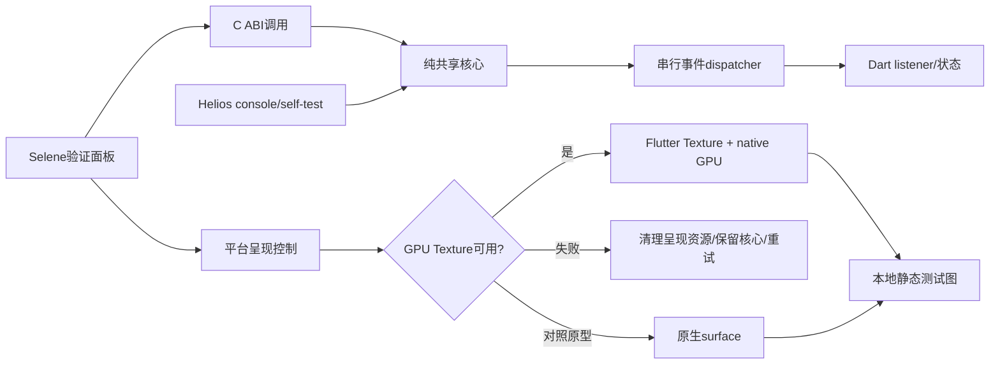

# Phase 2: Monorepo 与 Flutter/原生骨架 - Research

**Researched:** 2026-10-07
**Domain:** Windows C++ / C ABI / Flutter native plugin / lifecycle / CI
**Confidence:** MEDIUM（官方文档核验；尚无产品原型构建或运行证据）

<user_constraints>
## User Constraints (from CONTEXT.md)

以下逐字复制锁定决策、研究裁量和延后事项；原文自身已区分已确认约束与候选。来源：[CITED: .planning/phases/02-monorepo-flutter/02-CONTEXT.md]。

### Selene 骨架演示

- **D-01:** 首屏采用原生验证面板，展示核心版本、能力和运行状态，提供创建/释放句柄、启动/停止测试画面的操作。
- **D-02:** 打开面板自动初始化原生核心，立即可查看版本与能力；测试画面由用户手动启动。
- **D-03:** 原生测试画面采用可手动切换的静态测试图，包含色条、网格和文字。明确标注为本地原生呈现测试；性能结论由测量记录提供。
- **D-04:** 窗口尺寸变化时保持测试图比例，完整显示并留边。

### Helios 启动与退出

- **D-05:** 开发骨架为前台控制台程序，显示版本、初始化状态与诊断信息，通过 Ctrl+C 请求正常退出。
- **D-06:** 正常启动完成初始化后保持运行，等待退出；自检通过独立入口触发，供本地和 CI 使用。
- **D-07:** 本地运行初始化失败时显示错误并等待按键确认；正常退出完成清理后也保留最终结果并等待按键，再结束进程。
- **D-08:** 自动化运行始终直接退出，成功/失败通过退出码表达，失败为非零；不等待交互输入。

### 生命周期与错误反馈

- **D-09:** Selene 核心初始化失败时保留窗口，在面板内显示原因与诊断详情，提供重试，禁用依赖核心的操作。
- **D-10:** 核心已初始化但画面启动失败时，保留核心，清理失败的呈现资源，允许单独重试画面；版本与能力仍可查看。
- **D-11:** 关闭 Selene 窗口时自动停止本地测试画面、释放原生资源并退出；清理失败留下诊断记录，无额外退出确认框。
- **D-12:** 验证面板默认显示状态和最近错误；错误码、生命周期事件及详细日志可展开查看。
- **D-13:** 上述本地资源清理不改变已批准的主机会话语义：未来客户端断连/切换不得隐式停止实例、应用或显示器组；显式 StopInstance 与 Disconnect 分开。

### 开发与构建体验

- **D-14:** 主仓库提供统一构建入口，日常构建必须明确选择 Helios 或 Selene；共享核心随所选目标构建，不默认构建双端。
- **D-15:** 构建与验证分别执行：构建命令专注所选目标，独立验证入口执行共享契约检查；CI 执行完整必需检查。
- **D-16:** 构建/自检的终端输出为简洁摘要，包含成功/失败、产物及日志路径；详细日志保存到文件，便于排查和留存证据。
- **D-17:** Windows CI 在 PR 和主分支提交时自动构建双端并执行必需检查，同时支持手动触发。

### 继承的已确认约束

- Aether 为单一 Monorepo、Helios/Selene 采用单一产品版本体系；Selene 为一个 Flutter 应用，Dart 负责 UI/设置/会话操作，原生层负责媒体热路径与系统集成，不逐帧传递视频或 PCM 到 Dart。
- Windows 10/11 Helios 是硬要求，不能因为工具链或参考上游提高主机最低版本；具体最低 build 由后续原型证据锁定。
- 五客户端目标及完整原功能范围保留；Flutter 3.44 与客户端最低版本仍为候选，Android API21–23 和 Linux 额外原目标差异仍属 v1。
- Apple 实现、目标构建和可运行的自动化检查仍属 v1；仅实机功能/性能/安装验收为 VFY-01/VFY-02 TODO，本阶段 Windows 骨架不能替代 Apple 构建证据。
- 全主机至多一个有效 ControlLease；授权只读观察者不具有输入、上行设备或实例/拓扑变更权限，各读流独立计入预算。完整仲裁留在对应实施阶段，本阶段契约不能与这些边界冲突。
- 协议基础为 NVIDIA GameStream 重构扩展，无旧端互通要求；本阶段不自行改成 WebRTC/QUIC 整体替代。
- Phase 1 的 compatible-open-source / retain-candidates 是路线意向，具体生产依赖与许可尚未批准；references/upstream 是忽略的研究资料，不隐式链接、复制为产品代码或提交为子模块。
- 研究、计划检查、验证和 Git 文档追踪开启，通常拆为 1–3 个小计划；讨论完成后进入规划，不自动执行产品实现。

### 研究与规划裁量及待验证事项

用户没有新增“你决定”答复；以下是本阶段原有研究/规划职责，不应写成用户已选定或已验证的技术结果：

- C++20 + C ABI + CMake 为核心候选；FFI 与 typed platform channels/Pigeon 的分工、绑定生成方式、依赖锁与单一版本来源形式由研究/规划具体化。
- 定义句柄所有权、线程与事件交付、错误/取消/停止、销毁后回调及重复操作行为；计划必须覆盖 CORE-02 的真实跨边界验证，不能只有 UI 演示。
- 原生 GPU Texture 优先测量，必要时采用原生 surface 与 Flutter 控制界面；必须记录 texture/surface 对照及限制、HDR/多窗风险和证据。静态图选择不取消 roadmap 要求的呈现原型研究，也不构成性能通过。
- 五平台 adapter 接口、组件目录与测试入口按现有架构边界组织；非 Windows 接口/占位不能宣称目标实现或构建通过。
- 交互/自动化模式区分、构建命令名称、日志位置、诊断字段、清理有界性和测试图具体尺寸由规划确定；自动化路径不得因按键等待而挂住。
- 本机 VS2026/WDK 已安装仅是组件存在证据，仍需真实原生构建与干净 checkout 构建；缺失依赖按 docs/DEVELOPMENT.md 给出组件、用途和版本/来源，保留未解决环境 gap。

### Deferred Ideas (OUT OF SCOPE)

无新增跨阶段功能想法，本轮讨论保持在 Phase 2 范围内。既有 TODO 和后续产品能力沿用已批准路线图，不因本轮骨架选择而延后或删除。
</user_constraints>

## Summary

建议选择 C++20 + C ABI + CMake 作为本阶段待验收核心方案，使用一个 standard Flutter plugin 承载平台资源，Dart FFI 直接调用核心。首先完成真实 DLL→Dart 事件、错误、取消、停止和销毁链路，再加入呈现；不能用 mock widget 演示代替 CORE-02。这是研究建议，技术选择尚未经过产品原型验证。[ASSUMED A1]

官方从 Flutter 3.38 推荐纯 FFI 使用 package_ffi，但需要 Flutter Plugin API 时仍指向 standard plugin；Aether 需要 Texture registrar，故不应仅用 package_ffi 模板替代平台插件。共享核心保持独立 CMake target，Flutter plugin 只连接核心并负责 texture/window 生命周期。[CITED: https://docs.flutter.dev/platform-integration/bind-native-code] 后一句为项目设计建议。[ASSUMED A1]

**Primary recommendation:** 三个顺序小计划；首个计划即交付真实跨边界 tracer，最后以干净 checkout 双端构建、契约测试和有证据边界的呈现报告验收。[ASSUMED A1]

## Architectural Responsibility Map

以下是建议责任映射，与已有架构边界一致；不是已实现状态。[ASSUMED A1] [CITED: docs/ARCHITECTURE.md]

| Capability | Primary Tier | Secondary Tier | Rationale |
|---|---|---|---|
| 验证面板、重试、状态/日志展开 | Flutter/Dart | plugin | 展示和操作不接收视频帧/PCM |
| 生命周期、事件、能力与错误 | shared native core | C ABI/FFI wrapper | Helios 和 Selene 共用可独立测试契约 |
| GPU资源、纹理注册、窗口关闭 | Windows adapter/plugin | Flutter layout | OS/engine 对象不能泄入核心 |
| Helios控制台、Ctrl+C、自检 | host executable | shared core | 自动化模式与交互等待明确分离 |
| 五平台边界 | native adapter interface | respective plugin | 非Windows仅接口/占位，状态明确 |
| 版本、构建入口、干净构建证据 | repository tooling/CI | CMake + Flutter | 单一来源生成双端版本 |

## Project Constraints (from AGENTS.md)

全部为项目指令摘取，来源：[CITED: AGENTS.md]。
- 从 STATE、当前阶段与直接规范开始；遵循 ARCHITECTURE、SESSION-MODEL，greenfield 无产品代码模式。
- 一个 Monorepo、一个 Selene Flutter app、一个产品版本来源；Dart UI 与 native realtime/system 分离。
- NVIDIA GameStream 重构扩展是锁定基础；不得改为 WebRTC/QUIC 整体替代。
- Windows10/11 主机硬要求，最低build后续原型锁定；不可借上游/工具链抬高下限。
- 完整适用原功能保留，新遗漏默认进入v1；能力条件必须协商、解释并保存证据。
- 并行流受编码会话/解码/显存/带宽限制，预算事前协商；主机 ControlLease 全局唯一。
- 断连/切换保留实例和显示组，只有显式停止清理；观察者不得输入、上行或修改会话。
- references/upstream 仅忽略的研究资料，不复制/链接为产品代码、不提交子模块、不在其内提交产品。
- Apple实现和目标构建属v1，仅实机功能/性能/安装验收列TODO；工具/API/骨架不等于支持。
- GSD内变更、Git文档追踪、研究/计划检查/验证开启；互动顺序，每阶段通常1–3计划，不自动执行全部产品。
- 候选、用户选定和实际验证分别记录；缺依赖请求明确组件/用途/版本/官方来源；不覆盖已审阅环境快照。
- 无项目专属skills；配置 agent_skills 为空。本研究属于已启动的 plan-phase 工作流。[CITED: .planning/config.json]

<phase_requirements>
## Phase Requirements

| ID | Description | Research Support |
|---|---|---|
| CORE-01 | 维护者能从主仓库入口构建 Helios 和唯一 Selene Flutter 应用，共享模块和版本来源。 | shared CMake target、单一版本生成、目标选择入口 |
| CORE-02 | Selene 能通过有所有权/线程/取消契约的 C ABI 获取原生事件和能力，不传递逐帧媒体到 Dart。 | 实DLL tracer、异步listener停机barrier、ownership与负向测试 |
| CORE-03 | 维护者能运行共享契约检查及 Windows 构建 CI，查看五平台 adapter 的统一接口。 | CTest+真实Dart集成、五端能力接口、clean CI |
</phase_requirements>

上述需求逐字来源：[CITED: .planning/REQUIREMENTS.md]。

## Standard Stack

| Component | Version / status | Purpose / provenance |
|---|---|---|
| Flutter/Dart | 候选固定3.44.0 / 3.12.0 | 本机缓存元数据和Dart版本命令吻合；SDK pin不等于产品支持。[CITED: docs/PLATFORM-MATRIX.md:7] |
| C++ / CMake | C++20候选；PATH CMake4.4.3 | 本轮版本查询；标准目标隔离、CTest，不引入Qt。[ASSUMED A1] |
| Visual Studio | 本机18.10.12201.205；bundled CMake4.3.1-msvc1 | vswhere与对应CMake版本查询；Flutter使用的CMake要单独记录，不能只记PATH版本。[CITED: 本轮本机工具查询] |
| C ABI / dart:ffi | SDK自带 | 函数/定宽字段/opaque handle；C++异常不得穿过ABI。[ASSUMED A2] |
| Windows D3D11 + Flutter Texture registrar | SDK/engine接口，本机3.44头文件已读 | GPU测试图与资源生命周期，不引入媒体库。[CITED: https://api.flutter.dev/windows-embedder/flutter__texture__registrar_8h_source.html] |
| CTest / Flutter test / integration_test | CMake/Flutter SDK | 原生contract+widget+真实DLL跨边界验证。[CITED: https://docs.flutter.dev/testing/integration-tests] |

**Version pinning:** 建议仓库记录 Flutter framework/engine revision、Dart、MSVC、两套CMake、Windows SDK、架构和generator；提交 workspace pubspec.lock，根版本元数据生成 C/C++ 与 Dart 版本并用测试比对；禁止读取上游checkout依赖、绝对开发机路径或latest SDK。[ASSUMED A3] Pub workspace共享lockfile有官方依据。[CITED: https://dart.dev/tools/pub/workspaces]

## Package Legitimacy Audit

本轮未安装依赖。seam实际执行 `package-legitimacy check --ecosystem pub ffigen ffi pigeon` 返回 `Usage: ... --ecosystem <npm|pypi|crates>`，不能给pub包伪造OK/SUS/SLOP。pub API本机TLS查询失败；网页registry可读但绝对发布日期/完整传递依赖尚未核验。[CITED: 本轮命令输出]

| Candidate | Official source / observed version | Verdict / disposition |
|---|---|---|
| ffigen | 官方FFI指南→tools.dart.dev；包主页23.0.0，版本列表缓存22.0.0；main pubspec sdk明确为“>=3.10.0 <4.0.0” | NOT-AUDITED；绑定生成优先候选，执行前核验精确发布版本、hash、许可、传递依赖及LLVM |
| ffi | dart-lang/native；网页2.2.0，来源仓库main不是发布包证据 | NOT-AUDITED；仅确需allocator/string helpers时引入 |
| pigeon | Flutter官方channel指南；registry29.0.6，Min Dart3.11 | NOT-AUDITED；typed platform control候选，执行前审计及锁版本 |

来源：[CITED: https://pub.dev/packages/ffigen] [CITED: https://raw.githubusercontent.com/dart-lang/native/main/pkgs/ffigen/pubspec.yaml] [CITED: https://pub.dev/packages/ffi/versions] [CITED: https://pub.dev/packages/pigeon/versions]。这些候选不是已批准生产依赖。[ASSUMED A4] 不运行npm查pub同名包，不执行自动下载。首次依赖选用建立独立来源/许可清单；若审计无法完成，计划应放具体 human-verify checkpoint，不锁成已获批准。[ASSUMED A4]

## Architecture Patterns

建议数据流与任务结构如下，均属待实现方案。[ASSUMED A1]


**Component responsibilities / proposed paths:** `native/core/`独立静态/共享目标与C头；`native/platform/`五端接口及Windows实现；`packages/selene_native/`FFI wrapper、plugin和生成绑定；`apps/helios/`控制台；`apps/selene/`唯一app；`scripts/`构建/验证；`tests/`原生/CLI检查。路径为规划提议，无创建脚本证据，不标VERIFIED。[ASSUMED A1]

**C ABI contract:** opaque整数token+generation或不可解引用opaque handle；固定宽度status、operation ID、ABI version和struct_size；输入借用仅到同步调用返回、异步任务须copy；返回字符串使用caller-owned buffer或成对native free；全出口catch异常并转换status；invalid/null/stale handle、重复stop/cancel/destroy行为写成头文件规范。[ASSUMED A2]

**Threads/events/shutdown:** 操作短时返回，长操作在native worker；单一dispatcher发低频事件，字段尽量按值传，避免短命指针。Dart listener异步到创建isolate，native不等待其返回，只支持void；指针必须保持到callback完成；close后native调用为undefined behavior。本机Dart3.12 ffi.dart:432–449、498–518已打开，与官方API吻合。[CITED: https://api.dart.dev/dart-ffi/NativeCallable/NativeCallable.listener.html]

建议关闭顺序：拒绝新请求→cancel/stop worker→join并禁止新事件→Dart等待已发布序列全部处理/确认terminal barrier→异步unregister texture完成→释放GPU/plugin资源→destroy核心→close listener→窗口退出。无需依赖未声明的跨线程消息到达顺序；追踪sequence与pending。stop成功必须证明producer静默，dispose后无业务callback；若超时，保留诊断和安全引用，不能free活跃producer仍用的内存。此barrier协议与清理预算须在首计划实测，未作为API自带保证。[ASSUMED A2]

**Failure isolation:** 核心初始化失败仅保留UI和重试；render失败回滚D3D/注册资源但不destroy核心；每步资源获取后RAII登记，失败注入覆盖创建device、texture、register、首帧、unregister；重试不得多注册或沿用过期generation。[ASSUMED A2]

**Helios:** Ctrl+C handler只请求停止，由主控制流程完成join/清理；本地成功/失败后按D-07保留结果，明确automation/self-test入口禁止按键等待，非零失败，输入重定向也不能挂住。[ASSUMED A5] [CITED: .planning/phases/02-monorepo-flutter/02-CONTEXT.md]

## Don't Hand-Roll

| Problem | Use instead / boundary |
|---|---|
| 跨C++ ABI和手写多端协议业务 | C头+生成FFI绑定；核心单一实现，平台薄适配。[ASSUMED A1/A4] |
| callback内存自动安全假设 | explicit ownership、stop/join、pending barrier与负向测试。[ASSUMED A2] |
| 自写媒体/密码/驱动解决呈现 | SDK GPU资源、Flutter registrar；本阶段不提前引入codec或网络安全实现。[CITED: docs/ARCHITECTURE.md] |
| 逐平台独立版本/全能自制构建系统 | 一个version source、CMake presets、Flutter build、薄目标选择脚本。[ASSUMED A3] |

## Common Pitfalls / Presentation Prototype

GPU Texture与CPU PixelBuffer是不同接口。官方GPU descriptor接受D3D11Texture2D或DXGI shared handle，引用需保留到engine打开，release_callback用于释放该引用；unregister是异步且提供完成callback。CPU pixel-buffer callback通常在render thread，需要同步和保证buffer生存到unregister。本机Flutter3.44对应头文件24–53、70–127、159–173已读取。[CITED: https://api.flutter.dev/windows-embedder/flutter__texture__registrar_8h_source.html]

建议以同一Windows原生静态色条/网格/文字源比较GPU Texture与独立native surface；CPU Texture只用于对照或解释失败，不得替代GPU tracer。记录Flutter engine/backend、OS/GPU/driver、格式/尺寸/DPI/缩放、copy路径、resize/重复启停/关闭与失败资源计数；静态图不能推导60fps、解码延迟、玻璃到玻璃或零拷贝通过。HDR/多窗暂为待测风险；接口当前列RGBA/BGRA8不能证明完整HDR路径不可能。[ASSUMED A6]

反证研究找到Flutter官方issue191468报告Windows Impeller下DXGI textures崩溃（已closed）；只能证明曾有具体报告，不能推断固定3.44必现或已修复。原型需记录实际backend并复测资源交接。[CITED: https://github.com/flutter/flutter/issues/191468]

## Code Examples

官方模式节选（不引用未知Aether枚举/路径；listener生命周期前提见A2）。[CITED: https://api.dart.dev/dart-ffi/NativeCallable/NativeCallable.listener.html]
```dart
final listener = NativeCallable<Void Function(Uint64)>.listener(
  (int sequence) { /* 更新低频事件；按序列确认pending */ },
);
// 将listener.nativeFunction交给native。
// 仅在native producer停止且已发布事件完成后：
listener.close();
```
上述sequence回调与barrier是建议骨架，尚未编译验证。[ASSUMED A2] 不将内存指针或媒体buffer放入此消息。

## Recommended Sequential Plans

三计划是研究建议；具体名称、命令和路径由planner定义并在计划内创建，均非既有值。[ASSUMED A1/A3/A5]
1. **核心+真实FFI tracer：** 根version/CMake最小目标，Helios自检，唯一Flutter app+plugin，五平台接口，真实DLL版本/能力/创建/事件/错误/cancel/stop/destroy；原生及Dart负向测试随实现交付。技术/依赖核验在此计划先完成，不先建空目录和mock演示。
2. **Windows呈现与用户生命周期：** GPU Texture静态图与surface对照、面板D-01–04/D-09–12、Helios D-05–08、窗口关闭barrier、故障注入/资源计数、原型限制报告；CORE-02已能早期发现边界错误。
3. **统一入口与clean CI：** D-14–17目标选择build和独立verify，lock/source/generator drift检查、PR/push/workflow_dispatch、全量必需检查、双端产物/log；保留旧Android/Linux差异研究台账与Apple构建executor责任。

## Environment Availability

| Dependency | Observation | Execution prerequisite / fallback |
|---|---|---|
| Flutter/Dart | 本轮缓存3.44.0和Dart版本3.12.0；未运行wrapper bootstrap | 固定revision、真实windows smoke build |
| CMake/MSVC | 本轮PATH4.4.3、VS bundled4.3.1-msvc1、vswhere18.10.12201.205 | Flutter与Helios分别记录实际generator/toolchain，不能以版本输出代替构建 |
| Ninja/Node | 本轮1.12.0 / 24.14.0 | Node用于现有检查；Ninja仅选定时使用 |
| SDK/WDK | 已审阅快照含配套SDK/WDK及VS集成 | Phase2不用安装driver；host build floor仍待Phase3–5 |
| LLVM/libclang | PATH clang无结果，常见LLVM路径libclang.dll不存在；不是全盘不存在证明 | ffigen前定位或请求明确官方版本，不安装本轮 |
| Apple/Linux executor、Win10/ARM目标 | 基线保留未核验缺口 | 显式责任/构建步骤，不能伪造本机target支持 |
| GitHub remote/runner权限 | 本轮未核验可用repository/Actions执行结果 | 写可运行workflow；执行时留run URL、image和artifacts证据 |

来源：[CITED: 本轮本机工具查询] [CITED: docs/DEVELOPMENT.md] [CITED: docs/baseline/environment.json]。无新快照覆盖。AndroidAPI21–23与LinuxARM32/实验RISC-V/板卡保留v1差异；本阶段做工具/ABI可行性证据与具体后续适配拆分，Windows成功不可关闭这些gap。[CITED: docs/PLATFORM-MATRIX.md:14-16] 不以Apple硬件TODO豁免macOS/iOS构建义务。[CITED: .planning/PROJECT.md]

## Validation Architecture

nyquist/security启用：原文“nyquist_validation”: true、“security_enforcement”: true。[VERIFIED: .planning/config.json:25-49]

| Layer | Proposed test / command | Meaning |
|---|---|---|
| Native CTest | `ctest --preset <native-test> --output-on-failure` | null/stale handle、ABI版本/size、重复操作、错误转换、并发cancel/stop、无销毁后callback、预算内停机；<30s目标须实测 |
| Real Dart FFI | `dart test <native-contract-test>`（在锁定core DLL已构建后）或Flutter integration native test | 实际加载DLL；版本一致、native worker事件抵达正确isolate、错误/cancel确认、drain/destroy/close、循环重建；禁止mock core |
| Widget | `flutter test <panel-test>` | 初始化/失败/retry、render失败保持core、操作禁用、比例留边；不得代替native验证 |
| Windows integration | `flutter test integration_test -d windows` | 实plugin/engine texture start/stop/resize、关闭与失败清理；GUI runner须能执行，否则记录具体缺口 |
| CLI/CI | 独立root verify入口+Helios automation/self-test | stdin重定向、非零失败、无按键等待、带空格checkout、无上游研究目录仍构建 |
| Existing baseline | `node scripts/validate-planning.cjs`；Node既有基线suite | 文档/基线回归，不能替代CORE产品检查 |

全部命令/新测试路径为待创建方案。[ASSUMED A7] Native测试无需新GoogleTest包：CTest注册小型contract executable，release检查不用可能被NDEBUG删掉的assert。[ASSUMED A7]

**Requirements map:** CORE-01→clean双端build+运行版本一致；CORE-02→native contract+真实Dart DLL callback及停机测试；CORE-03→五端接口编译/未实现状态+独立verify+Windows CI。**Per task:**相关native或Dart快速组，记录实际时长；**per wave/phase:**完整native、Dart/widget/integration、Helios自检及现有baseline检查，clean checkout双端构建。GPU外观/比例人工验收与真实target证据独立，不宣称自动性能通过。[ASSUMED A7]

**Wave 0 gaps:** 原生CMake/CTest、core C头与测试driver、FFI生成配置与真实DLL fixture、Flutter app/plugin/pub workspace、panel/integration tests、统一version/build/verify、Windows CI均需建立。现有tests/planning.test.cjs只检规划fixture；本轮validate-planning为PASS，node --test因sandbox child spawn EPERM失败，无隔离模式仍无法spawn fixture child；这是本轮运行限制，无产品测试结果。[CITED: tests/planning.test.cjs] [CITED: 本轮命令输出]

## Security Domain

使用ASVS5.0名称，避免模板旧V2/V3/V4/V5编号错配；ASVS面向应用安全，本阶段仅取适用控制，不声称认证产品已验证。[CITED: https://cheatsheetseries.owasp.org/IndexASVS.html]

| Applicable category | Phase control proposal |
|---|---|
| V1 Encoding/Sanitization + V2 Validation/Business Logic | C ABI size/enum/长度/句柄/generation校验、日志界限、不信任native入参。[ASSUMED A2] |
| V6 Authentication / V7 Session Management / V8 Authorization | 本阶段无远端认证；不实现假授权；契约保持Disconnect与StopInstance、观察者与ControlLease边界。[CITED: docs/SESSION-MODEL.md] |
| Secure coding / configuration / logging | ABI异常隔离、bounded shutdown、依赖hash/source、日志脱敏。[ASSUMED A2/A3] |

CI最小权限、action full SHA pin，不使用pull_request_target执行不可信PR代码；Windows hosted runner为新VM但镜像可迁移，建议显式windows-2025-vs2026并记录实际镜像/tool版本。CI build不能证明Win10 runtime或GPU/HDR性能。[CITED: https://docs.github.com/en/actions/reference/security/secure-use] [CITED: https://github.com/actions/runner-images] [ASSUMED A3] 威胁重点为use-after-free/迟到事件(Tampering)、无界队列/停机hang(DoS)、日志含路径/凭据(Information disclosure)、依赖漂移(Spoofing)；以所有权测试、队列上限、日志过滤和锁定来源处理。[ASSUMED A2/A3]

## State of the Art

纯FFI package_ffi与需要Plugin API的standard plugin已在官方文档区分；Aether应按资源责任选模板，不机械沿用legacy plugin_ffi。[CITED: https://docs.flutter.dev/platform-integration/bind-native-code] ffigen最新文档偏向programmatic Dart配置、YAML已标deprecated；新生成流程避免照抄旧YAML。[CITED: https://pub.dev/packages/ffigen] CMake官方支持VS18 2026；本机Flutter3.44 visual_studio.dart:182–188原文含“18 => 'Visual Studio 18 2026'”，只证明识别逻辑，不证明成功构建。[CITED: https://cmake.org/cmake/help/latest/generator/Visual%20Studio%2018%202026.html]

## Assumptions Log / Open Questions

| ID | Unverified recommendation / risk |
|---|---|
| A1 | C++20/CMake+standard plugin、三计划与目录责任；需首真实tracer验证，不能写用户已选定 |
| A2 | token/generation、事件序列barrier、所有权/停机预算和失败回滚；需ABI/Dart/engine交互负向验证 |
| A3 | version元数据、锁定策略、目标选择和CI镜像；实际checkout/runner/toolchain仍待执行 |
| A4 | ffigen/ffi/Pigeon精确版本、合法性与许可；pub seam缺支持，首次选用需具体清单核验 |
| A5 | CLI automation、Ctrl+C和交互检测细节；需真实process超时/退出码测试 |
| A6 | GPU Texture/surface比较及统计方法；未有原型，HDR/零拷贝/多窗不能下支持结论 |
| A7 | 测试路径、命令、耗时/runner可用性；计划需创建并实测，不把拟议命令当通过记录 |

### Planning Disposition — A1–A7

下表关闭的是规划选择，不是运行风险或产品支持结论。**RESOLVED for planning** 表示 PLAN 已选定具体实施路径、责任与验证入口；当前尚无执行证据，研究置信度仍为 MEDIUM，所有真实依赖/构建/测量/平台缺口保持 UNVERIFIED。用户锁定约束与研究原文范围不变。

| ID | Planning disposition / task references | UNVERIFIED execution evidence / prerequisite |
|---|---|---|
| A1 | **RESOLVED for planning** — 02-01-01 采用 C++20、独立 CMake core DLL、standard Flutter plugin 与 Dart FFI；三计划按 native boundary → Windows resource lifecycle → reproducible build/CI 顺序执行，02-01-03 保留五平台统一能力接口。 | 实际 MSVC/CMake/Flutter 编译与真实 DLL tracer 尚待执行；设计选择不是用户已实测或技术支持证明。 |
| A2 | **RESOLVED for planning** — 02-01-01/02 选择 generation token、固定宽度 scalar callback、serial dispatcher、sequence ACK drain、256 pending-event/32 admitted-operation 界限；core 停机 2 秒，02-02-02 规定 render 2 秒与窗口总清理 5 秒、安全 TIMEOUT retention。 | ABI shape/所有权/线程、cancel/stop race、在途事件与无 disposal 后 callback，仍须 native/真实 Dart DLL/engine 负向测试证明。 |
| A3 | **RESOLVED for planning** — 02-01-01 选择 version.json、单一 pub workspace lock、toolchains.lock.json、version/binding generators 和 Windows CMake presets；02-03-01/02 选择明确 Target build、独立 verify、SHA/hash 锁与 clean checkout/Windows CI。 | 精确工具链可用性、来源/hash核验、生成漂移、两端运行版本、clean build 与实际 Actions run 仍待执行；runner/tool版本输出不是构建证明。 |
| A4 | **RESOLVED for planning** — 02-01-01 选择先审计 ffigen 23.0.0/ffi 2.2.0 精确候选及传递依赖，再解析/锁定；programmatic generator 先验证 libclang.dll/include paths。候选不兼容时按具体原因锁兼容精确版本；缺失 libclang 请求明确官方 LLVM Windows x64 组件/兼容版本。所选 typed platform controls 不要求 Pigeon。02-03-01 检查 source/license/hash/binding drift。 | 实际 registry archive、publisher、LICENSE、SHA256、SDK兼容和本地 libclang 位置仍未审计/验证；具体未知生产复制/链接许可或工具缺失是执行前提，不构成包已批准或编译已通过。 |
| A5 | **RESOLVED for planning** — 02-02-02 规定 Helios 默认 foreground liveness、handler 只发 Ctrl+C shutdown request、独立 --self-test/--automation、真实 terminal 成功/失败最终按键，redirected stdin/CI 不等待，非零失败和有界进程测试。 | 实际 exe 的 stdin/terminal/console-signal/cleanup 行为及诊断仍待运行；缺少 console capability 必须留具体执行缺口。 |
| A6 | **RESOLVED for planning** — 02-02-01/03 选择同源 1280×720 BGRA8 原生静态色条/网格/文字、真实 D3D11 GPU Texture 与 native HWND/swapchain surface 对照、完整等比留边、原始分轮记录和 unavailable 原因；不以 CPU image 替代 GPU 路径。 | 实际 GPU/backend/driver、copy path、异步 unregister、画面/DPI、三轮测量和资源回滚仍待执行；静态图不证明帧率/媒体延迟/零拷贝/HDR/多窗，原风险保持。 |
| A7 | **RESOLVED for planning** — 02-01 创建 native CTest 与 real-DLL Dart fixture/check-core 三 suites；02-02 创建 widget/Windows engine 与 Helios process/check-ui/check-helios suites；02-03 创建工具/平台/source guards、All clean verification 与完整 Windows CI，02-VALIDATION 固定每任务命令及 fails_when。 | 测试入口需由各对应任务创建；实际通过/计数/耗时、GUI/CI executor 及全量必需结果仍待执行，缺失/空选择/跳过不能 green。 |

剩余 **UNVERIFIED execution risks**：依赖审核和 libclang 位置；真实 Flutter/MSVC 双端构建；GPU Texture/surface 测量；Win10 目标；Android 旧 API/Linux 额外架构适配；Apple/Linux 执行器。均有具体执行前提和责任，不阻止生成 Windows 骨架计划，不自动缩小 v1 范围；缺少实际必需 Windows CI 结果时，CORE-03/D-17 与 Phase 2 保持未完成，最终人审不能豁免。[CITED: docs/BASELINE-REVIEW.md] [CITED: .planning/phases/02-monorepo-flutter/02-01-PLAN.md] [CITED: .planning/phases/02-monorepo-flutter/02-02-PLAN.md] [CITED: .planning/phases/02-monorepo-flutter/02-03-PLAN.md]

## Sources / Metadata

Primary sources fetched：Flutter FFI/platform-channels/Windows embedder；Dart NativeCallable；CMake generator/presets；Dart pub workspace；pub.dev包与dart-lang/native；GitHub官方runner/security；OWASP ASVS。关键链接已在相应段落给出。Current官网为Flutter3.47/Dart3.13.5；本机3.44/3.12头文件另行核验，不能合并为同版本证据。[CITED: https://docs.flutter.dev/platform-integration/bind-native-code] [CITED: https://api.dart.dev/dart-ffi/NativeCallable/NativeCallable.listener.html]

Research seam：四问题research-plan产出context7/websearch；本环境无Context7工具/ctx7 CLI，使用官方web fallback。classify-confidence --provider websearch --verified实际为MEDIUM；webfetch未被该seam识别为authority时返回LOW，未据此虚升HIGH。四项research-store curated写入因用户cache目录mkdir EPERM未保存；研究内容完整保存在本文件，不新增仓库cache或改全局路径。[CITED: 本轮seam命令输出]

**Confidence breakdown:** standard stack MEDIUM（工具/官方接口已读，未构建）；architecture MEDIUM（锁定设计边界+未测方案）；pitfalls MEDIUM（官方callback/registrar契约，原型风险保留）。**Valid until:** 2026-10-14，执行前复核registry/CI可变内容。[ASSUMED A3] Greenfield无需Runtime State Inventory。本轮不提交，由父规划流程统一提交。

