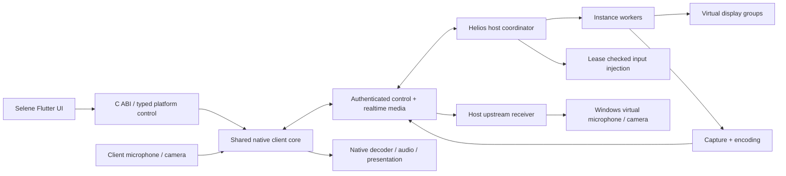

# 架构与 Flutter 责任边界

状态：初始化建议。已确认的产品约束见 PROJECT.md；具体库、驱动、线协议在小型原型后锁定。

## 组件与数据流

Helios 协调器持有实例登记、认证、控制租约、显示资源预算与管理接口。实例工作进程持有捕获、编码及应用进程关联，设备操作通过受限 Windows 适配访问。服务运行在 Session 0 时，捕获和输入必须放入交互登录会话代理；不能直接在服务桌面捕获用户画面。

## 责任表

| 层 | 应承担 | 边界 |
|----|--------|------|
| Flutter/Dart | 导航、发现列表、配对交互、实例选择、设置、权限说明、布局、统计展示 | 不承担逐帧视频/PCM传递、编解码和传输调度 |
| 共享 C++ 核心候选 | 协议契约、传输抽象、时间戳、队列、重连、拥塞模型、输入与多流管理 | 不依赖 Qt，不依赖 Flutter，不直接散布 OS API |
| C ABI + Dart FFI | 生命周期句柄、配置、事件、能力、统计；生成绑定 | 禁止 C++ ABI 跨边界；必须定义所有权、取消与线程约束 |
| 平台插件 | 设备权限、窗口/外屏、纹理注册、系统剪切板、音频会话、硬件 SDK | 同仓库实现，不在各端重复协议与业务逻辑 |
| 原生呈现 | GPU texture/surface、解码、音频实时输出、帧调度 | 首先测量 Flutter Texture/HDR/多窗表现，必要时采用原生视频 surface 与 Flutter 控制界面 |
| 原生输入 | 低延迟鼠标、键盘/手柄、触摸/笔事件捕获与标准化 | UI 焦点与快捷键由 Flutter 协调；高频路径不得频繁序列化大消息 |

Flutter 官方提供 [platform channels](https://docs.flutter.dev/platform-integration/platform-channels) 和 [FFI](https://docs.flutter.dev/platform-integration/bind-native-code)。这里的责任划分是项目设计推论：小型控制消息走 typed channels/FFI，帧和音频走原生缓冲/纹理；不能仅凭 Flutter 支持某平台推断媒体功能已经可用。

## 平台适配

- Windows：D3D11/DXGI/WGC 候选捕获，D3D11 视频呈现，WASAPI 音频；NVENC/AMF/oneVPL 或 FFmpeg 对应后端必须实测。
- Apple：VideoToolbox、Metal、AVAudioEngine/AVAudioSession、AVFoundation/GameController；macOS 与 iOS 共用核心及可复用的 Apple 模块，平台权限/窗口差异单独适配。
- Android：MediaCodec、Surface、低延迟音频候选、Camera2/AudioRecord、输入与多 Display API。
- Linux 客户端：FFmpeg + VA-API/Vulkan 候选，PipeWire/PulseAudio/ALSA，Wayland/X11 权限与多屏路径分别验证。

## 协议边界

Aether 协议在 NVIDIA GameStream 基础上重构扩展，以固定版本 Moonlight/Sunshine 的开源实现为可核验基线。必须明确 GameStream 原有会话、控制/输入和实时媒体的保留/修改映射，再定义 Aether 版本、能力协商、身份、host/instance/display/stream ID、控制租约 epoch、序号、时间戳、错误码与重配置 ACK；不要求与旧端互通。详见 [协议设计边界](PROTOCOL.md)。

逻辑通道：可靠控制、低延迟视频、下行音频、上行麦克风、上行摄像头、输入、剪切板、反馈/统计。未来文件/VPN/打印用显式扩展契约，不提前实现。

Phase 6 从 GameStream 的 RTSP 会话协商、UDP/RTP 媒体/FEC 与控制/输入通道出发重构，验证多流隔离、上行媒体、安全、重连和资源预算。具体包格式、端口分配、ENet使用与替换范围通过原型锁定；WebRTC/QUIC 不再是协议基础候选，若局部替换确有必要，必须解释与 GameStream 基线的关系并在关键节点确认。不能把所有实时视频塞进单个可靠有序流，也不能自行设计密码算法。

## 资源和恢复

每主机资源预算包含编码并发、显存、分辨率×帧率、上行解码、客户端硬解流数和总带宽。客户端请求超过能力时提供拒绝/降级方案；不承诺任意数量满规格流。

码率修改按 stream 或会话总预算定义，ACK 返回生效版本与实际目标。可原地重配则原地重配；必要时替换编码器并产生关键帧，但连接与实例 ID 保持不变，明确短暂卡顿预算。

配对后身份持久化、撤销与权限粒度必须覆盖控制、启动、停止、剪切板及上行设备。重连不能绕过鉴权，所有修改请求都校验权限和 epoch。

## 构建组织

共享 CMake 工程 + Flutter workspace/packages，单一协议生成与版本来源。第三方生产依赖使用锁定版本、源码/二进制来源与 SBOM；references/upstream 不链接进产品。

Phase 1 记录工具版本、平台最低版本、原功能全集及来源许可；Phase 2 再锁定可构建核心。禁止为了“从零”重复造编解码器/密码学，也禁止直接搬入旧多仓库 UI。
